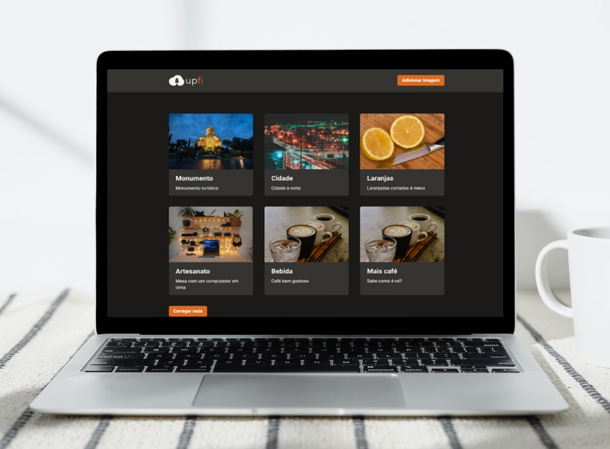

# ☁️ upfi

  

### Projeto criado no treinamento Ignite da Rocketseat

## ➡️ Sobre 
Essa é uma aplicação onde o principal objetivo foi adicionar alguns trechos de código para que a aplicação de upload de imagens funcione corretamente. Ela deve realizar requisições para sua própria API Next.js que vai retornar os dados do FaunaDB (banco de dados) e do ImgBB (serviço de hospedagem de imagens). A interface implementada deve seguir o layout do Figma. 

### Ver projetos: 

)

## 🚀 Tecnologias 
-   [x] Next.js
-   [x] Chakra UI
-   [x] Typescript
-   [x] Axios
-   [x] React Query (useInfiniteQuery)
-   [x] FaunaDB
-   [x] ImgDB
-   [x] react-hook-form
